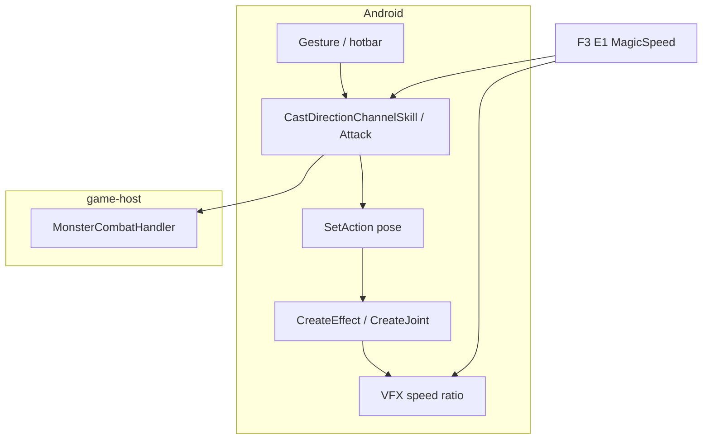
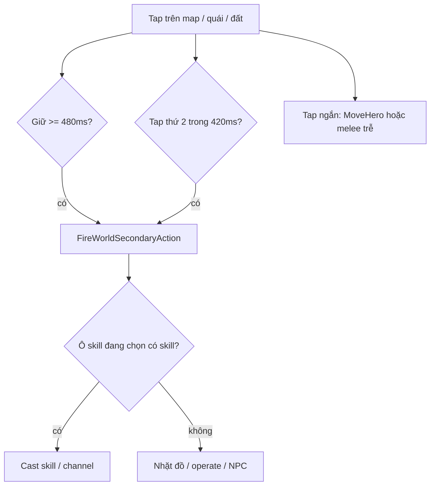

# Hướng dẫn skill combat trên mobile (Takumi)

**Cập nhật:** 2026-05-21  
**Phạm vi:** Android client (`Source/5.Main`) + `server-next` game host (Season 6 wire).  
**Liên quan:** [SKILL-QA-CHECKLIST.md](./SKILL-QA-CHECKLIST.md) (**SSOT QA** — 286 skill + checkbox) · [SKILL-QA-CHECKLIST.csv](./SKILL-QA-CHECKLIST.csv) (Excel) · [ANDROID-INPUT.md](./ANDROID-INPUT.md) (gesture) · [game-spec/SKILL-HOTKEY-PERSISTENCE.md](../game-spec/SKILL-HOTKEY-PERSISTENCE.md) · [qa/M9-mg-skill-combat.md](../qa/M9-mg-skill-combat.md) (QA APK)

---

## 1. Tóm tắt (19–20/05)

| Hạng mục | Trạng thái | Ghi chú |
|----------|------------|---------|
| Cast skill MG trên mobile (wire) | ✅ | Long-press / double-tap + hotbar; channel `0x1E` |
| Server nhận **C3** magic continue | ✅ | Trước chỉ parse C1 → Linh hồn không damage |
| Damage formula Webzen (wiz / phys skill) | 🟡 | **46** combat `wiz`/`phys`; **17** `pend`; **8** `tap` (`0x11`) — [SKILL-QA-CHECKLIST.md](./SKILL-QA-CHECKLIST.md#công-thức-damage-2026-05-21--đã-code-chưa-qa-hết) |
| VFX + tốc độ **Linh hồn (9)** | ✅ | `GetEvilSpiritJoint*`, `GetMagicSpeedEffectRatio` |
| VFX tốc độ **Lốc (8)** | ✅ partial | `MODEL_STORM` scale; spawn VFX channel TODO |
| Server hit volume (AoE đúng hình) | 🟡 | Evil Spirit ✅ · Bão điện (237) ✅ Chebyshev r6; Twister 🟡 corridor — [SKILL-QA-CHECKLIST.md](./SKILL-QA-CHECKLIST.md) |
| Animation đầy đủ skill MG khác | ⬜ | Wire + damage OK; pose/VFX riêng chưa nối mobile |
| QA account `test` / `mg001` | ✅ **4/30** combat QA done | 9 · 8 · 55 · **237** — tiếp **56** · `./scripts/db/reset-mg001-skills.sh` |
| Scripts `server-next/scripts/` | ✅ | Bỏ wrapper trùng; chỉ thư mục con |

---

## 2. Tầm damage vs VFX màn hình (Linh hồn 9, Bão điện 237)

**Triệu chứng:** Quái ở xa trên màn hình trông như trúng skill (hiệu ứng / bầy quái trong khung hình) nhưng **không có số damage**; log server `hits=0` trong khi vẫn thấy `statDmg=…`.

**Nguyên nhân (không phải packet lỗi):**

| Lớp | Cách tính |
|-----|-----------|
| **Server** | Chebyshev từ **ô nhân vật**: `max(|dx|,|dy|) ≤ range`. Center luôn `(PositionX, PositionY)` — bỏ qua tọa độ aim trong packet `0x1E`. |
| **Linh hồn (9)** | `range=7` (OpenMU S6; client `Skill.txt` Radio=6 chỉ là UI). |
| **Bão điện (237)** | `range=6`, omnidirectional `mode=0` (5 tia 72° quanh nhân vật). |
| **Client VFX** | Hiệu ứng có thể phủ vùng **nhìn** rộng hơn (góc isometric, quái spawn góc màn hình). **Không** đồng nghĩa server gửi damage. |

**Ví dụ Kanturu:** Hero `(226,49)`, quái góc màn `(236,92)` → khoảng cách ô `max(10,43)=43` → **ngoài** range 6–7 → `hits=0` là đúng.

**Log server khi không trúng ai nhưng có quái gần trong viewport:**

```text
[m9] magic continue skill=9 … hits=0 … near=12 closestTile=43 player=(226,49)
```

`near` = số quái trong vòng `(range+12)` ô nhưng ngoài range; `closestTile` = quái sống gần nhất (ô).

**QA:** Chỉ kỳ vọng damage khi quái trong vòng **ô** quanh hero; đứng sát bầy quái trên map (cùng cụm tile), không chỉ cùng khung hình.

---

## 3. Vấn đề gốc — Linh hồn có VFX, không mất máu quái

**Triệu chứng:** Trên APK, cast Linh hồn (skill 9) thấy linh hồn bay, log client `cast=1`, nhưng quái không giảm HP; server không log `[m9] magic continue`.

**Nguyên nhân:** Client Android gửi skill channel qua `SendRequestMagicContinue` → trên wire thường là **C3** (encrypted), sub **0x1E**. Server `TryFindMagicContinue` chỉ khớp **C1**, bỏ qua toàn bộ packet.

**Sửa:** `ClientHitPackets602.TryFindMagicContinue` chấp nhận **C1 và C3**; `MonsterCombatHandler.HandleMagicContinueAsync` + catalog skill 9 (và MG tương tự).

**Xác nhận server:**

```bash
cd server-next
docker compose logs -f game-host 2>&1 | grep '\[m9\]'
# Khi channel Linh hồn: [m9] magic continue skill=9 ...
```

---

## 4. Kiến trúc 5 lớp (mỗi skill “done” trên mobile)



| Lớp | Ý nghĩa | MG hiện tại |
|-----|---------|-------------|
| **A** Input | Long-press, double-tap, hotbar slot | ✅ |
| **B** Wire TX | `0x1E` / `0x19` / `0xDB` / `0x11` | ✅ channel + targeted + burst |
| **C** Server damage | Parse, range, `stat_roll` (wiz/phys/tap/pend) | 🟡 MG/DW wired; xem cột **Roll** + **F** trong checklist |
| **E** Animation nhân vật | `SetAction` skill (wheel, two-hand, …) | ⬜ hầu hết = pose `SetPlayerMagic` chung |
| **F** VFX thế giới | Joint, storm, slash, inferno model | ✅ skill 9; ⬜ 55, 56, 236, … |
| **G** Tốc độ VFX | `MagicSpeed` / `AttackSpeed` ratio | ✅ 9; partial 8 |

**Lưu ý:** cột **W** (wire) tick trong [SKILL-QA-CHECKLIST.csv](./SKILL-QA-CHECKLIST.csv) **không** có nghĩa đã có animation đẹp — chỉ là gửi packet đúng. Cần tick **A** + **V** + **QA** riêng.

---

## 5. Chuyển đổi PC → Mobile (click, long-press, double-tap)

Trên PC, **chuột trái (LMB)** = di chuyển / đánh thường / nhặt (tùy target); **chuột phải (RMB)** = dùng skill đang chọn / dùng đồ túi. Trên Android không có nút phải — Takumi map sang **tap ngắn**, **giữ ~480ms**, **chạm hai lần nhanh** (~420ms, cùng vị trí ±28px UI), cộng **joystick** và **nút ATTACK**.

**Hằng số** (`TakumiAndroidInput.cpp`): long-press **480ms**; cửa sổ double-tap **420ms**; hủy long-press nếu kéo ngón **>48px** (tọa độ UI ảo 640×480).



### 4.1 Di chuyển & tương tác thế giới (thay LMB)

| PC (chuột trái) | Mobile | Code / hành vi |
|-----------------|--------|----------------|
| Click **đất** (đi bộ) | **Tap ngắn** lên mặt đất (không long-press / không double-tap skill) | SDL touch → `MouseLButton*` → `MoveHero()` |
| Click **quái** (đánh thường) | Tap ngắn lên quái → sau **~420ms** nếu không có double-tap thứ hai → `FireWorldMeleeAttack` | `TakumiAndroid_ProcessWorldSkillFrame` → `Attack(Hero)` |
| Click **item rơi** | Tap ngắn: chọn; **long-press / double-tap** (không cast skill): nhặt | `FireWorldPickUpItem` → `MoveHero()` + pick |
| Click **chest / lever** | Long-press / double-tap khi không cast skill | `FireWorldOperateObject` |
| Click **NPC** | Tap ngắn: đi / tương tác; long-press nếu không skill | `FireWorldNpcTalk` |
| **Joystick** (không có trên PC cũ) | Góc trái dưới — di chuyển 8 hướng | `android_main.cpp` virtual pad |
| **Nút ATTACK** (góc phải dưới) | Chỉ **đánh thường** (LMB parity), **không** cast skill hotbar | `TriggerVirtualCombat(true)` |

**Lưu ý:** Tap ngắn **không** cast skill đang gán trên ô chính — cast skill cần **long-press**, **double-tap**, hoặc **tap icon hotbar / skill ring** (xem §4.2).

Vùng HUD **không** nhận gesture map (tránh cast nhầm khi bấm joystick/ATTACK/skill bar): `TakumiAndroid_IsHudBlockingWorldGesture`.

### 4.2 Dùng skill trên map (thay RMB)

**Điều kiện:** Có skill trên **ô đang chọn** (`Hero->CurrentSkill` hoặc hotkey `0` đã gán qua picker). Gesture gọi `FireWorldSecondaryAction` → ưu tiên `FireWorldSkillAttack`.

| PC (chuột phải) | Mobile | Client |
|-----------------|--------|--------|
| RMB lên **quái** (skill single-target) | Long-press hoặc double-tap lên quái | `PrepareWorldSkillTarget` → `PulseAndroidSkillAttack` / `Attack` → wire `0x19` |
| RMB **giữ** (channel: Linh hồn, Lốc, …) | **Long-press** giữ ngón: cast lần đầu + **tick channel** mỗi frame khi vẫn giữ | `CastDirectionChannelSkill` + `FireWorldSkillChannelTick("hold")` |
| RMB giữ channel (PC) | **Double-tap** nhanh: bật channel **latched** (tiếp tục tick không cần giữ) | `g_worldSkillChannelLatched` + `ProcessWorldSkillFrame` |
| RMB lên **đất** (AoE / hướng) | Long-press / double-tap lên đất trong tầm | `CheckTarget` + channel / ground target |
| RMB buff / heal lên người / NPC | Cùng gesture; target ưu tiên player → NPC → self | `IsSupportOrSelfSkillType` |
| RMB khi **không** có skill / cast fail | Fallback: nhặt → operate → NPC talk | Thứ tự trong `FireWorldSecondaryAction` |

**Skill channel** (Linh hồn 9, Lốc 8, Fire Slash 55, …): không đi `Attack()` PC — dùng `CastDirectionChannelSkill` + `SendRequestMagicContinue` (`0x1E`). Danh sách: `IsDirectionChannelSkillType()` trong `ZzzInterface.cpp`.

**Skill một phát** (Sét, Hỏa cầu, Inferno tap, …): long-press / double-tap → `PulseAndroidSkillAttack` → `Attacking == 2` khi thành công.

| Loại skill | Gesture cast | Wire (server) |
|------------|--------------|---------------|
| Channel (9, 8, 55, 56, 236, …) | Long-press (hold) / double-tap (latch) | `0x1E` C1/C3 |
| Targeted bolt | Long-press / double-tap | `0x19` |
| AoE burst (Inferno) | Long-press / double-tap | `0xDB` |
| Đánh thường | Tap quái (trễ) hoặc nút ATTACK | `0x11` |

### 4.3 Gán skill lên hotbar & chọn skill đang dùng

Khác với cast trên map — đây là **chọn skill nào** sẽ được RMB-equivalent (long-press / double-tap) dùng.

| PC | Mobile | Ghi chú |
|----|--------|---------|
| Phím **0–9** / Ctrl+phím | **Legacy HUD:** tap icon Q–R; **Mobile HUD:** tap **skill ring** (4 ô) | `AndroidTriggerHotKeySkillTap` / `TriggerVirtualCombat(false, slot)` |
| Click **ô skill chính** (khung lớn) | Tap ô skill → mở **picker** danh sách skill đã học | `TryToggleSkillPickerAtTouch` |
| Chọn dòng trong picker | Tap một skill trong list | `ApplySelectedSkillIndex` → `SetSkillHotKey(0, index)` + `SaveOptions()` |
| Gán skill vào ô 1–9 | Chế độ assign (long-press picker) → tap ô ring/slot | `NewUIMainFrameWindow` assign flow |
| Relog giữ ô skill | Server **F3 30** (30 byte hotkey) + DB `character_roster.key_configuration` | [SKILL-HOTKEY-PERSISTENCE.md](./game-spec/SKILL-HOTKEY-PERSISTENCE.md) |

**Join game:** Server gửi **F3 11** (skill đã học) **trước** **F3 30** (hotkey). QA MG: `test/mg001` có **30 skill combat** (slot 1–30) — `scripts/db/reset-mg001-skills.sh`.

### 4.4 Học skill từ sách / dùng đồ túi (thay RMB trong inventory)

| PC | Mobile | Client |
|----|--------|--------|
| **RMB** lên ô đồ trong túi (sách skill, fruit, potion, scroll…) | Mở túi → **long-press ~480ms** hoặc **double-tap** lên ô đồ | `FireInventoryLongPressUse` → pulse `VK_RBUTTON` → `AndroidTryUseItemNow()` → `TryConsumeItem()` |
| RMB kéo / dùng nhanh | Tap ngắn + **kéo** (drag) vẫn như PC | `MouseLButton` drag path |
| Học skill từ **Skill Book** | Cùng long-press/double-tap trên sách trong túi (đủ điều kiện class/level) | Server trả skill mới → lần sau có trong picker |

**Logcat túi đồ:**

```bash
adb logcat -s TakumiInvUse
```

Long-press trong túi **không** cast skill ra map — chỉ `TryConsumeItem` (học skill, uống potion, v.v.).

### 4.5 Thứ tự ưu tiên (long-press / double-tap trên map)

Khi một gesture kích hoạt `FireWorldSecondaryAction`:

1. **Cast skill** (nếu hotbar/ô chính có skill và có target hợp lệ)
2. **Nhặt item** dưới chân
3. **Operate** object (rương, công tắc, …)
4. **NPC talk** / buff friendly

Nếu bước 1 thất bại (không target, hết mana, …), client thử bước 2–4 — giống PC khi RMB không cast được skill.

### 4.6 Bảng tra nhanh “tôi muốn…”

| Muốn làm | Trên mobile |
|----------|-------------|
| Đi bộ | Joystick hoặc **tap ngắn** đất |
| Đánh thường | Tap quái (ngắn) hoặc nút **ATTACK** |
| Cast Linh hồn / channel MG | Gán skill ô 0 → **long-press** quái/đất (giữ) hoặc **double-tap** |
| Cast Hỏa cầu / Sét | Gán skill → long-press / double-tap lên quái |
| Học skill từ sách | Mở túi → long-press / double-tap lên sách |
| Đổi skill đang dùng | Tap ô skill chính → chọn trong picker |
| Gán skill vào ring | Assign mode → tap slot ring |
| Nhặt đồ | Long-press / double-tap (khi không cast skill) hoặc tap + đi tới |

### 4.7 Debug

```bash
adb logcat -s TakumiSkillAtk TakumiInvUse SkillPicker
```

Spec ngắn (1 trang): [ANDROID-INPUT.md](./ANDROID-INPUT.md).

---

## 6. Magic Gladiator — skill đã convert (mobile + server)

Nhân vật QA: **`test` / `mg001`** (Duel Master, class wire 120). Join gửi **F3 11** từ `character_skill` (30 combat, compact slot).

### 5.1 Bảng nhanh

| ID | Tên | Wire | Cast mobile | Damage server | Anim + VFX client |
|----|-----|------|-------------|---------------|-------------------|
| 9 | Linh hồn | `0x1E` | ✅ channel | ✅ Chebyshev r7 | ✅ đầy đủ + MagicSpeed |
| 8 | Lốc | `0x1E` | ✅ | 🟡 corridor `mode=2` | speed storm ✅; spawn TODO; QA wide-hit |
| 61–65 | Linh hồn MG+ | `0x1E` | ✅ | ✅ | kế thừa 9 |
| 55 | Fire Slash | `0x1E` | ✅ | ✅ | ⬜ wheel + gathering |
| 56, 48–52 | Power Slash | `0x1E` | ✅ | ✅ | ⬜ two-hand + magic2 |
| 236 | Flame Strike | `0x1E` | ✅ | ✅ | ⬜ flame model |
| 237 | Gigantic Storm | `0x1E` | ✅ | ✅ | ✅ chebyshev r6 `mode=0` (5-bolt VFX) |
| 238 | Chaotic | `0x1E` | ✅ | ✅ | ⬜ |
| 3–5, 12 | Sét / Hỏa cầu / Độc | `0x19` | ✅ tap | ✅ stat | ⬜ projectile VFX |
| 13–14 | Inferno / Hell | `0xDB` / `0x1E` | ✅ | ✅ | ⬜ |

Ma trận đầy đủ: [SKILL-QA-CHECKLIST.csv](./SKILL-QA-CHECKLIST.csv) · [SKILL-QA-CHECKLIST.md](./SKILL-QA-CHECKLIST.md).

### 5.2 Wire head (server router)

| Head | Handler | Ví dụ MG |
|------|---------|----------|
| `0x1E` (C1/C3) | `HandleMagicContinueAsync` | 9, 8, 55, 56, 236, 237, 238, … |
| `0x19` | Targeted + stat damage | 3, 4, 5, 12 |
| `0xDB` | Magic burst AoE | 13 Inferno |
| `0x11` | Melee | Đánh thường (nút ATTACK) |

Catalog: `server-next/src/Takumi.Server.Protocol/SkillCombatCatalog.cs`  
Combat: `server-next/src/Takumi.Server.Game/World/MonsterCombatHandler.cs`

---

## 7. Client — file chính đã sửa

| File | Thay đổi |
|------|----------|
| `ZzzInterface.cpp` | `CastDirectionChannelSkill`, `IsDirectionChannelSkillType` (MG channel list) |
| `Platform/TakumiAndroidInput.cpp` | World skill gesture → channel cast; bỏ duplicate channel list |
| `ZzzCharacter.cpp` | `GetMagicSpeedEffectRatio()`, `GetEvilSpiritJoint*`; `SetAttackSpeed` / `SetPlayerMagic` |
| `ZzzEffectJoint.cpp` | Linh hồn joint velocity/humming theo MagicSpeed |
| `ZzzEffect.cpp` | `MODEL_STORM` tick/rotation ∝ `GetMagicSpeedEffectRatio()` |

**Công thức tốc độ (tham chiếu Linh hồn):**

- Ratio = `BCalculateAttackSpeed(0) / 447`, clamp **0.5× – 3×**
- Áp cho `Velocity`, `Scale`, `MoveHumming` joint spirit; storm dùng cùng ratio ở effect loop

**Build APK:** Bắt buộc sau đổi client VFX/cast/animation.

```bash
cd Source/android
./gradlew :app:assembleRealDevicePreloadDefaultDebug
```

---

## 8. Server — file chính đã sửa

| File | Thay đổi |
|------|----------|
| `ClientHitPackets602.cs` | `TryFindMagicContinue` — C1 + C3 |
| `SkillCombatCatalog.cs` | MG continue / targeted / burst, range, **hit mode** (omni / arc / corridor) |
| `SkillCombatRange.cs` | `IsMobInSkillVolume` — Chebyshev / forward arc / Twister corridor |
| `SkillCombatDirection.cs` | `IsInForwardArc`, `IsInForwardCorridor` |
| `CharacterCombatPreview602.cs` | MG `MagicDamage` từ Energy |
| `PlayerSkillCombatDamage602.cs` | Wizardry / hybrid fallback |
| `MonsterCombatHandler.cs` | `0x1E` / `0x19` / `0xDB`, log `[m9]` |
| `GamePortMinimalSession.cs` | `DecryptedRx` signature fix |
| `LegacyLoginHostRunner.cs` | Cùng fix `DecryptedRx` |
| `JoinSkillLifecycle.cs` | F3 11 từ `character_skill` (không đổi logic) |
| `CharacterSkillCatalog.cs` | Default 30 combat MG; `NormalizeMagicGladiatorForClientWire` trước F3 11 |

**Tests:** `SkillCombatCatalogMgTests`, `MonsterCombatWire602Tests` (C3 `0x1E`).

**Rebuild server (không cần APK nếu chỉ sửa server):**

```bash
cd server-next
./scripts/docker/docker-stack.sh --host-build --detach
```

---

## 9. DB & skill list QA (`test` / `mg001`)

| Script | Mục đích |
|--------|----------|
| `scripts/db/reset-mg001-skills.sh` | Xóa + seed 30 combat MG (slot 1–30) |
| `scripts/db/verify-mg001-skills.sh` | Kiểm tra 30 type + compact slot |

```bash
cd server-next
./scripts/db/verify-mg001-skills.sh
# OK — all 44 rollout skills present.
```

**Sau khi apply SQL:** restart `game-host`, **thoát game và vào lại** `mg001` để nhận `F3 11` mới.

Skill hotkey persistence: [game-spec/SKILL-HOTKEY-PERSISTENCE.md](./game-spec/SKILL-HOTKEY-PERSISTENCE.md).

---

## 10. Quy trình test nhanh (MG)

1. Stack: `./scripts/docker/docker-stack.sh --host-build --detach`
2. USB (nếu cần): `./scripts/android/adb-reverse-takumi-dev.sh`
3. Cài APK mới (nếu đổi client)
4. Login `test` → `mg001` → Lorencia
5. Gán Linh hồn / Fire Slash vào ô skill 0 (picker)
6. Long-press hoặc double-tap lên quái:
   - Server: `[m9] magic continue skill=9` (hoặc 55, 56, …)
   - Quái mất HP
7. Đổi đồ +speed → linh hồn bay nhanh hơn (chỉ sau rebuild APK client)

Checklist QA chi tiết: [qa/M9-mg-skill-combat.md](../qa/M9-mg-skill-combat.md).  
Tracking done/chưa từng skill: [SKILL-QA-CHECKLIST.md](./SKILL-QA-CHECKLIST.md).

---

## 11. Việc tiếp theo (animation MG)

| Sprint | Skill | Việc client |
|--------|-------|-------------|
| S1b | 55, 56 | `SetAction` wheel / two-hand + gathering / sword force |
| S1c | 236, 237 | `CreateEffect` flame strike / gigantic storm khi channel |
| S1 | 8 | Spawn `MODEL_STORM` ổn định khi channel |

Pattern: sau `CastDirectionChannelSkill`, gọi cùng nhánh `AttackStage` / `switch(c->Skill)` như PC (`ZzzCharacter.cpp`).

---

## 12. Tài liệu & script liên quan

| Tài liệu | Nội dung |
|----------|----------|
| [DEVELOPMENT-LOG-2026-05-20.md](../journal/DEVELOPMENT-LOG-2026-05-20.md) | Nhật ký thay đổi 19–20/05 |
| [SESSION-WORKLOG-2026-05-19.md](../journal/SESSION-WORKLOG-2026-05-19.md) | Spawn, damage màu, scripts layout |
| [server-next/scripts/README.md](../server-next/scripts/README.md) | Lệnh docker/db/android/smoke |
| [server-next/docs/combat/M9-NPC-MONSTER-CHECKLIST.md](../server-next/docs/combat/M9-NPC-MONSTER-CHECKLIST.md) | Dev M9 viewport/combat |
