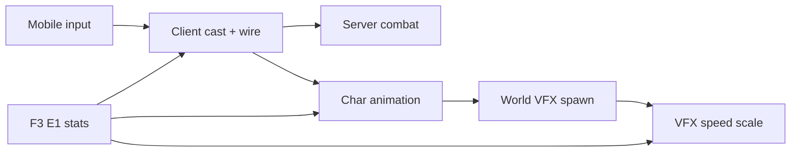

# Kế hoạch rollout skill combat (toàn class)

**Ngày:** 2026-05-20  
**Phạm vi:** Takumi Android client (`Source/5.Main`) + `server-next` game host.  
**Mục tiêu:** Mỗi skill playable trên mobile có **cast đúng wire**, **server ra damage đúng stat**, **animation nhân vật + hiệu ứng thế giới**, **tốc độ VFX khớp MagicSpeed/AttackSpeed** (parity PC Season 6).

**Hướng dẫn thực tế (đã làm 19–20/05):** [MOBILE-SKILL-COMBAT-GUIDE.md](./MOBILE-SKILL-COMBAT-GUIDE.md) · QA APK: [qa/M9-mg-skill-combat.md](../qa/M9-mg-skill-combat.md) · Nhật ký: [DEVELOPMENT-LOG-2026-05-20.md](../journal/DEVELOPMENT-LOG-2026-05-20.md)

---

## 1. Trạng thái hiện tại

| Hạng mục | Evil Spirit (9) | Skill MG/DW khác (55, 56, 236…) | Ghi chú |
|----------|-----------------|----------------------------------|--------|
| Mobile cast (`CastDirectionChannelSkill`) | ✅ | ✅ (wire) | Gửi `C1/C3 0x1E` — **không đồng nghĩa có animation đầy đủ** |
| Server parse + damage | ✅ | ✅ catalog (2026-05-20) | `[m9] magic continue` / targeted / aoe |
| **E. Animation nhân vật** (`SetAction`) | ✅ generic | ⬜ hầu hết | Chỉ `SetPlayerMagic` → `PLAYER_SKILL_HAND1`; skill riêng cần `PLAYER_ATTACK_SKILL_WHEEL`, v.v. |
| **F. VFX thế giới** (`CreateEffect`/`CreateJoint`) | ✅ joint spirit | ⬜ / `p` | Mỗi skill có `case` trong `ZzzCharacter.cpp` / `ZzzEffect.cpp` |
| **G. Tốc độ VFX** ∝ stat | ✅ | ⬜ / `p` (Lốc) | `GetEvilSpiritJoint*`, `GetMagicSpeedEffectRatio` — mới áp 9 + 8 |
| Melee `0x11` | ✅ một phần | — | Log `[m9] combat hit` |
| Các class khác | — | ⬜ | DW/DK/ELF tiếp theo |

**Vì sao chỉ Linh hồn “có animation” rõ?** Sprint trước ưu tiên **server damage + wire channel**; client chỉ implement **đủ 3 tầng animation** cho skill 9 (joint bay + `SetPlayerMagic`). Các skill khác: mobile đã **cast + damage**, nhưng chưa nối `CastDirectionChannelSkill` → `AttackStage` / `switch(c->Skill)` spawn effect và `SetAction` theo từng skill.

**Prerequisite đã có:** `F3 E1` → `ViewMagicSpeed` / `ViewPhysiSpeed`; `SetAttackSpeed()` + `SetPlayerMagic()` (pose cast chung).

---

## 2. Kiến trúc 5 lớp (mỗi skill)

Mỗi skill cần checklist **5 lớp** (tách **animation** khỏi **VFX**) trước khi đánh dấu “done”:



| Lớp | File chính | Deliverable | Linh hồn (9) | MG channel khác |
|-----|------------|-------------|--------------|-------------------|
| **A. Input** | `TakumiAndroidInput.cpp` | Gesture, `IsDirectionChannelSkillType` | ✅ | ✅ |
| **B. Client TX** | `ZzzInterface.cpp` | `SendRequestMagicContinue` / `0x19` / `0xDB` | ✅ | ✅ wire |
| **C. Server** | `MonsterCombatHandler.cs`, `SkillCombatCatalog.cs` | Parse, damage, range | ✅ | ✅ |
| **E. Animation nhân vật** | `ZzzCharacter.cpp` (`SetAction`, `AttackStage`) | Pose + frame skill (`PLAYER_ATTACK_SKILL_WHEEL`, …), `SetAttackSpeed` | ✅ generic cast | ⬜ cần `SetAction` đúng skill |
| **F. VFX thế giới** | `ZzzCharacter.cpp` (`MoveCharacter` → `c->Skill` switch), `ZzzEffect*.cpp` | `CreateJoint` / `CreateEffect` / `MODEL_STORM` | ✅ `BITMAP_JOINT_SPIRIT` | ⬜ từng `case AT_SKILL_*` |
| **G. Tốc độ VFX** | `GetMagicSpeedEffectRatio`, `GetEvilSpiritJoint*` | Scale velocity / tick / `PlaySpeed` effect | ✅ | ⬜ theo nhóm effect |

**Luồng PC (đủ animation):** `UseSkillWizard` / `Attack()` → `SetAction` skill-specific → `AttackTime` tăng → `AttackStage` + `switch(c->Skill)` tạo effect.

**Luồng mobile hiện tại:** `CastDirectionChannelSkill` → `SetPlayerMagic` (pose chung) + `SendRequestMagicContinue` → **chưa** gọi `SetAction` / spawn effect của từng skill (trừ nhánh đã có trong `AttackStage` khi `c->Skill` khớp và `AttackTime` đạt ngưỡng — Linh hồn là ngoại lệ đã nối).

**Quy tắc tốc độ:**

- **Magic / channel / projectile:** `CharacterAttribute->MagicSpeed` (sau `BCalculateAttackSpeed(0)` + cap theo skill trong `BCalculateAttackSpeed`).
- **Melee / wheel / fury:** `AttackSpeed` + `BCalculateAttackSpeed(1)`.
- **Base reference:** Evil Spirit dùng ratio `magicSpeed / 447` (cap 0.5×–3×) cho `Velocity`, `Scale`, `MoveHumming`.

---

## 3. Pha 0 — Hạ tầng (1–2 ngày)

| # | Task | Owner | Output |
|---|------|-------|--------|
| 0.1 | Bảng skill SSOT | `docs/` + CSV từ `Skill.bmd` / OpenMU | `docs/android/SKILL-MATRIX.csv`: id, name, class, wire, range, damage type |
| 0.2 | Mở rộng `SkillCombatCatalog.cs` | server | `IsHandled`, `GetRange`, `GetBaseDamage`, `UsesWizardryDamage`, `UsesPhysiDamage` |
| 0.3 | Router combat thống nhất | server | Một entry: scan packet → dispatch theo head (11/19/1E/DB) |
| 0.4 | Log chuẩn | server | `[m9] magic continue`, `[m9] skill targeted`, `[m9] magic aoe` — bật qua env |
| 0.5 | Helper client tốc độ | client | Tách `TakumiSkillMotion.h` (ratio MagicSpeed/AttackSpeed theo skill group) — tránh copy Evil Spirit |
| 0.6 | Test wire | server | `Takumi.Server.Tests`: 1 test/head tối thiểu |
| 0.7 | **Bridge animation mobile** | client | Sau `CastDirectionChannelSkill`: gọi cùng `SetAction` + seed `AttackTime` như PC; map skill → `AttackStage` case |
| 0.8 | Ma trận animation | `docs/android/SKILL-MATRIX.csv` | Cột `client_char_anim`, `client_world_vfx` (tách `client_vfx_speed`) |

---

## 2b. Checklist animation theo nhóm skill

| Nhóm | `SetAction` cần | VFX spawn (`Create*` / model) | File tham chiếu | Mobile hiện tại |
|------|-----------------|-------------------------------|-----------------|-----------------|
| Channel spirit (9, 61–65) | `SetPlayerMagic` | `BITMAP_JOINT_SPIRIT` ×4 | `ZzzCharacter.cpp` ~5500 | ✅ đủ |
| Channel storm (8) | `SetPlayerMagic` | `MODEL_STORM` | `ZzzEffect.cpp` | ⬜ VFX speed ✅; spawn khi channel ổn định |
| MG sword channel (55 Fire Slash, 56 Power Slash) | `PLAYER_ATTACK_SKILL_WHEEL` / `PLAYER_ATTACK_TWO_HAND_SWORD_TWO` | `BITMAP_GATHERING`, `BITMAP_SWORD_FORCE`, `MODEL_MAGIC2` | `ZzzCharacter.cpp` ~3582–3634 | ⬜ chỉ pose tay generic |
| MG burst (236 Flame, 237 Gigantic) | frame trong `AttackStage` | `MODEL_EFFECT_FLAME_STRIKE`, `BITMAP_JOINT_THUNDER` | ~5671–5695 | ⬜ |
| Targeted bolt (3–5, 12 `0x19`) | `SetPlayerMagic` / skill cast | projectile trong `ZzzEffect` | `Attack()` PC path | ⬜ tap gửi wire, thiếu bolt VFX |
| AoE một phát (13 Inferno `0xDB`) | cast pose | `MODEL_SKILL_INFERNO` | ~5485 | ⬜ |
| DK melee / wheel | `PLAYER_ATTACK_*` | wheel, fury models | `AttackStage` | ⬜ |
| ELF multi-shot | bow action + cap speed | arrow trail | `BCalculateAttackSpeed` | ⬜ |

**Công việc chuẩn cho mỗi skill mới (client animation):**

1. Tìm `case AT_SKILL_*` trong `ZzzCharacter.cpp` (cả `AttackStage` lẫn `switch(c->Skill)` khi `AttackTime >= limit`).
2. Trong `CastDirectionChannelSkill` (hoặc helper `TakumiPlaySkillAnimation(c, skill)`): gọi **cùng** `SetAction` + gán `c->Skill`, `AttackTime = 1` như PC.
3. Nếu effect spawn ở `AttackTime` ngưỡng: đảm bảo mobile không reset `AttackTime` sớm khi `Attacking == 2` (channel).
4. Áp **G** (`GetMagicSpeedEffectRatio` / nhóm joint) cho effect đó.
5. Cập nhật `SKILL-MATRIX.csv`: `client_char_anim`, `client_world_vfx`, `client_vfx_speed`.

---

## 4. Pha 1 — Theo loại packet (ưu tiên trước class)

| Wire | Client API | Server handler | Skill ví dụ | Ưu tiên |
|------|------------|----------------|-------------|---------|
| `0x11` | `SendHitRequest` | `TryFindHitRequest` ✅ | Đánh thường, combo | P0 ✅ |
| `0x1E` | `SendRequestMagicContinue` | `TryFindMagicContinue` ✅ (C1+C3) | Linh hồn (9), Lốc (8) | P0 — mở rộng Storm VFX |
| `0x19` | `SendRequestMagic` / targeted | `TryFindTargetedSkill` | Hỏa cầu, Độc, Thiên giáng | P1 |
| `0xDB` | `SendRequestMagicAttack` | `TryFindMagicAttack` ✅ | AoE một phát (Inferno, …) | P1 |
| `0x18` | Position / instant | `ClientWalkPackets602` | Teleport skill | P2 |
| Buff / self | `F3` subs | `WorldGameplayHandlers` | Buff, heal | P2 (không damage mob) |

**Storm (8):** Cùng `0x1E` + server catalog — cần client `MODEL_STORM` scale theo `MagicSpeed` (khác joint spirit).

---

## 5. Pha 2 — Theo class (damage + animation + mobile)

### 5.1 Dark Wizard / Soul Master / Grand Master

| Skill ID | Tên | Wire | Server | Anim (E) | VFX (F) | Speed (G) |
|----------|-----|------|--------|----------|---------|-----------|
| 9 | Linh hồn | `0x1E` | ✅ | ✅ | ✅ | ✅ |
| 8 | Lốc | `0x1E` | ✅ | ⬜ | ⬜ | ✅ `MODEL_STORM` ratio |
| 5, 378 | Hỏa cầu line | `0x19` | ⬜ | ⬜ |
| 13, 382 | Lửa địa ngục | `0xDB`? | ⬜ | ⬜ |
| 38–39, 385–387 | Master upgrades | inherit | ⬜ | ⬜ |

### 5.2 Dark Knight / Blade Knight / Blade Master

| Nhóm | Wire | Ghi chú |
|------|------|--------|
| Đánh thường / Twisting Slash / Rageful Blow | `0x11`, skill anim | `AttackSpeed`, `BCalculateAttackSpeed(1)` |
| Skill 43, wheel | `0x19` / action | Animation đã có trong `SetAttackSpeed` — cần server hit |

### 5.3 Fairy Elf / Muse Elf / High Elf

| Nhóm | Wire | Ghi chú |
|------|------|--------|
| Multi-shot, Penetration | `0x19` | Elf caps trong `BCalculateAttackSpeed` (skill 52, 51, 24…) |
| Buff party | RX only | Không mob damage |

### 5.4 Magic Gladiator / Duel Master

| Skill ID | Tên | Wire | Server | Anim (E) | VFX (F) | Speed (G) |
|----------|-----|------|--------|----------|---------|-----------|
| 9, 61–65 | Linh hồn | `0x1E` | ✅ | ✅ | ✅ | ✅ |
| 8 | Lốc | `0x1E` | ✅ | ⬜ | ⬜ | ✅ |
| 55, 490, 493 | Fire Slash | `0x1E` | ✅ | ⬜ wheel anim | ⬜ gathering/force | ⬜ |
| 56, 48–52, 482 | Power Slash | `0x1E` | ✅ | ⬜ two-hand anim | ⬜ `MODEL_MAGIC2` | ⬜ |
| 236 | Flame Strike | `0x1E` | ✅ | ⬜ | ⬜ `MODEL_EFFECT_FLAME_STRIKE` | ⬜ |
| 237–238 | Gigantic / Chaotic | `0x1E` | ✅ | ⬜ | ⬜ thunder / chaotic FX | ⬜ |
| 3–5, 12 | Thunder / Fireball / Flame | `0x19` | ✅ | ⬜ | ⬜ projectile | ⬜ |
| 13–14 | Inferno / Hell | `0xDB` / `0x1E` | ✅ | ⬜ | ⬜ inferno model | ⬜ |

### 5.5 Dark Lord / Summoner / Rage Fighter

| Class | Ưu tiên | Blocker |
|-------|---------|---------|
| DL | P2 | Command / pet damage tách pipeline |
| SUM | P2 | Summon spawn chưa parity |
| RF | P2 | Skill head `0x4A`/`0x4B` nếu bật monk |

---

## 6. Pha 3 — Mobile UX (song song P1)

| Task | File |
|------|------|
| Skill picker → đúng `wireType` / channel | `NewUIMainFrameWindow.cpp` ✅ |
| Long-press / double-tap theo `SkillAttribute` | `TakumiAndroidInput.cpp` |
| Không gọi `Attack()` chặn wizard channel | `CastDirectionChannelSkill` ✅ |
| Target under finger | `CheckTarget` + viewport key remap server |

---

## 7. Ma trận tracking (mẫu)

Thêm hàng vào `docs/android/SKILL-MATRIX.csv`:

```
skill_id,class,wire,server_handler,client_cast,client_char_anim,client_world_vfx,client_vfx_speed,android_gesture,notes
9,DW/MG,0x1E,HandleMagicContinueAsync,y,y,y,y,double-tap,reference skill
55,MG,0x1E,HandleMagicContinueAsync,y,n,n,n,channel,needs PLAYER_ATTACK_SKILL_WHEEL + BITMAP_GATHERING
```

| Cột | Ý nghĩa |
|-----|---------|
| `client_cast` | Gửi đúng packet / `CastDirectionChannelSkill` |
| `client_char_anim` | `SetAction` + frame skill (`AttackStage`), không chỉ `SetPlayerMagic` |
| `client_world_vfx` | `CreateEffect` / `CreateJoint` / model spawn trong map |
| `client_vfx_speed` | Scale từ MagicSpeed/AttackSpeed (`y` / `n` / `p`) |
| `android_gesture` | double-tap, channel, tap, … |

**Lưu ý:** `client_cast=y` + `client_world_vfx=n` → đúng tình trạng “có damage, không thấy skill đẹp” trên Android.

---

## 8. Công thức damage server (chuẩn hóa)

| Loại | Nguồn | File |
|------|-------|------|
| Wizardry skill | `CharacterCombatCalculator602` + skill base | `PlayerSkillCombatDamage602.cs` |
| Physical skill | Attack rate + skill % | Mở rộng từ `MonsterCombatCalculator` |
| Plain melee | `0x11` | Hiện tại fixed/random — gắn stat sheet |
| Defense / miss | Monster DEF, level gap | `MonsterCombatCalculator` |

**OpenMU tham chiếu:** skill range, `AreaSkillAutomaticHits`, wizardry multiplier per skill.

---

## 9. Thứ tự đề xuất (sprint)

| Sprint | Nội dung | Xác nhận |
|--------|----------|----------|
| **S1** | Storm (8): **F+G** VFX spawn + speed; damage `0x1E` | Thấy tornado; log `skill=8` |
| **S1b** | MG channel **E+F**: Fire Slash (55), Power Slash (56) — `SetAction` + gathering/force | Pose wheel + slash VFX trên APK |
| **S1c** | MG **E+F**: Flame Strike (236), Gigantic (237) | Model flame / thunder joint |
| **S2** | Targeted magic P1: 5, 39, 13 — wire + **projectile VFX** | `0x19` + `0xDB` + bolt trên map |
| **S3** | DK melee + wheel **animation + server hit** | `0x11` + wheel model |
| **S4** | ELF bow + caps + arrow VFX | `BCalculateAttackSpeed` + `0x19` |
| **S5** | Matrix 80% DW/DK/ELF — cột anim đầy đủ | CSV `client_char_anim` / `client_world_vfx` |
| **S6** | RF/SUM/DL pet | sau viewport |

---

## 10. Kiểm thử mỗi skill

1. **Build APK** sau thay đổi client VFX/cast.
2. **Rebuild `takumi-game-host`** sau thay đổi server (không cần APK nếu chỉ server).
3. Logcat: `[SkillAtk]`, `[SkillPicker]`.
4. Docker: `docker compose logs -f game-host 2>&1 | grep '\[m9\]'`.
5. In-game: mob HP giảm, số damage khớp stat, tốc độ skill tăng khi đổi đồ +speed.
6. **Animation:** nhân vật làm đúng pose skill (không chỉ giơ tay generic); thấy effect trên map (joint, storm, slash, inferno).

---

## 11. File map nhanh

| Thành phần | Path |
|------------|------|
| Android skill attack | `Source/5.Main/source/Platform/TakumiAndroidInput.cpp` |
| Channel cast | `ZzzInterface.cpp` (`CastDirectionChannelSkill`, `IsDirectionChannelSkillType`) |
| Skill animation + VFX spawn | `ZzzCharacter.cpp` (`SetPlayerMagic`, `AttackStage`, `MoveCharacter` → `switch(c->Skill)`) |
| Evil spirit VFX speed | `ZzzCharacter.cpp` (`GetEvilSpiritJoint*`), `ZzzEffectJoint.cpp` |
| Storm / effect speed | `ZzzEffect.cpp` (`GetMagicSpeedEffectRatio`, `MODEL_STORM`) |
| Attack speed caps | `ZzzCharacter.cpp` (`BCalculateAttackSpeed`, `SetAttackSpeed`) |
| Server combat | `server-next/src/Takumi.Server.Game/World/MonsterCombatHandler.cs` |
| Skill metadata | `server-next/src/Takumi.Server.Protocol/SkillCombatCatalog.cs` |
| Wire parsers | `server-next/src/Takumi.Server.Protocol/ClientHitPackets602.cs` |
| Protocol map | `server-next/docs/protocol/M1-PROTOCOL-PARITY-MAP.md` |

---

## 12. Việc làm ngay (animation rollout)

1. **S1b** — Fire Slash / Power Slash: trong `CastDirectionChannelSkill` (hoặc helper) gọi `SetAction` như `AttackStage` PC (~3582–3634), giữ channel `Attacking==2`.
2. **S1c** — Flame Strike / Gigantic: trigger `CreateEffect` cases ~5671–5695 khi bắt đầu channel.
3. **Build APK** sau mỗi nhóm E+F; server rebuild chỉ khi đổi combat.
4. QA: so sánh cùng skill PC vs Android — pose + effect trên map, không chỉ số damage.
5. Cập nhật `SKILL-MATRIX.csv` khi từng skill đạt `client_char_anim=y` và `client_world_vfx=y`.

---

*Cập nhật khi hoàn thành từng skill trong `SkillCombatCatalog` hoặc `SKILL-MATRIX.csv`.*
