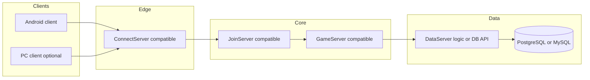

# Kế hoạch port MU server (Takumi `Source/1–4.*`) sang macOS / Linux

Mục tiêu: **chạy được trên Mac/Linux**, **stack dễ dev lâu dài** (tooling, test, CI, tuyển người), **giảm rủi ro** so với “chuyển hết 300k dòng Win32 một lần”.

Phạm vi thô: Connect / Data / Join nhỏ hơn; **GameServer ~280+ file `.cpp`** — phần nặng nhất (logic map, skill, item, event…).

Chi tiết checklist theo OpenMU (đường dẫn repo, Phase 0–6, Gate): **`docs/migration/TAKUMI-MIGRATION-OPENMU-CHECKLIST.md`**.

## Bắt đầu ngay (tuần 1–2): spike trước khi port nặng

1. **Baseline OpenMU:** `OpenMU/deploy/all-in-one` → `docker compose up -d --no-build`; đọc **`OpenMU/docs/Checklist-Server.md`** (admin panel, cổng, login test).
2. **Client “chuẩn S6”:** thử **[MuMain](https://github.com/sven-n/MuMain)** (hoặc client checklist gợi ý) lên OpenMU — xác nhận flow login → map (**protocol reference** của OpenMU).
3. **Takumi:** bắt traffic (pcap / log) Android hoặc `ClientBuild` khi còn nối **server Win cũ** → **golden packets** để đối chiếu với MuMain/OpenMU.
4. **Quyết A vs B:** nếu gói tin Takumi ≈ ENG S6 + MuMain extensions → lean **fork OpenMU (A)**. Nếu lệch nhiều (EX603 CS, encrypt custom) → **brownfield TCP + .NET (B)** có thể ít đụng codebase OpenMU hơn nhưng tự làm parsers.
5. **DB:** chọn hướng migrate **`MuOnline.bak`** sang **PostgreSQL** (hoặc giai đoạn đầu chỉ Postgres “mới” cho OpenMU và giữ SQL cũ song song).

Sau các bước trên mới vào Phase 0–3 bên dưới có kỷ luật.

---

## 1. Chiến lược tổng thể (chọn một hướng chủ đạo)

### Phương án A — **Tích hợp / fork theo [OpenMU](https://github.com/MUnique/OpenMU) (.NET)**

- **Ưu:** Đã cross-platform (macOS/Linux/Windows), kiến trúc module, plugin, community; phù hợp **dev lâu dài** (C#, SDK, test, Docker).
- **Nhược:** Protocol / season / custom Takumi phải **map** sang OpenMU (hoặc fork sâu). Không “port từng dòng” C++ GameServer cũ.
- **Khi nào chọn:** Muốn **bỏ Win32**, chấp nhận **định hướng lại** server theo model OpenMU + bổ sung tính năng custom qua plugin.

### Phương án B — **Viết lại có kiểm soát (brownfield) theo lớp dịch vụ**

- Giữ **tương thích gói tin / client** (wire format) với client Android hiện tại.
- Tách thành **dịch vụ độc lập** (Connect, Join, Data access, Game loop), từng phần thay thế server cũ.
- **Ưu:** Kiểm soát hành vi từng bước; có thể chạy song song với server cũ (shadow / canary).
- **Nhược:** Cần **spec gói tin + golden tests**; effort vẫn lớn nếu Game logic phải clone 1:1.

### Phương án C — **Port C++ đa nền tảng (CMake + thư viện cross-platform)**

- Thay Win32 API bằng abstraction (mạng, thread, file, DB).
- **Ưu:** Tái sử dụng tối đa thuật toán C++.
- **Nhược:** Khó tuyển, build phức tạp, **GameServer** quá lớn — thường **không** là lựa chọn “lâu dài dễ dev” trừ khi team C++ mạnh và chấp nhận cost.

**Khuyến nghị cho “dev tiếp lâu dài”:** ưu tiên **A hoặc B với stack .NET**; chỉ C nếu bắt buộc giữ C++ (hiếu kỹ thuật / performance edge case).

---

## 2. Tech stack đề xuất (ổn định 5–10 năm)

| Thành phần | Đề xuất | Lý do |
|------------|---------|--------|
| **Runtime / ngôn ngữ** | **C# + .NET 8 (LTS)** | Một runtime trên macOS/Linux/Windows; tooling (Rider/VS Code), test (xUnit), benchmark, DI, async; hệ sinh thái game private server phổ biến. |
| **Game / Connect / Join** | **ASP.NET Core** hoặc **generic host + Kestrel/TCP** tùy protocol | Dễ đóng gói Docker, health check, metrics (OpenTelemetry). |
| **Data access** | **EF Core** + **PostgreSQL** (primary) hoặc **MySQL 8** | Tránh lock-in Windows ODBC; chạy tốt trên Mac/Linux. Giữ **migration** versioned. Nếu bắt buộc SQL Server: dùng container Linux hoặc Azure — vẫn portable. |
| **Serialization / API nội bộ** | **MessagePack** hoặc **Protobuf** giữa service (nếu tách microservice) | Rõ schema, versioning. Wire client ↔ server MU: giữ **byte layout cũ** cho đến khi đổi client. |
| **Build & CI** | **Docker multi-stage**, **GitHub Actions** / GitLab CI | Build/test trên `ubuntu-latest` + `macos-latest` một phần. |
| **Quan sát vận hành** | **OpenTelemetry** + Prometheus/Grafana hoặc tối thiểu structured logging (**Serilog**) | Chuẩn industry, onboard dev mới nhanh. |
| **Test** | **xUnit**, **integration test** TCP với fixture DB, **golden packet** dumps từ client thật | Giảm regression khi đổi implementation. |

**Go/Rust:** tốt cho **gateway nhẹ** hoặc **worker** đặc thù hiệu năng — nhưng **domain logic MU** (+ seasonal custom) trong .NET dev/xử lý faster cho đa số team. Có thể hybrid sau (Go edge + .NET game core) nếu đo bottleneck thật.

---

## 3. Kiến trúc đích (mục tiêu logic, không ép microservice ngày đầu)

Giai đoạn đầu có thể **gom process** (một binary .NET nhiều listener) để giảm ops; sau tách khi cần scale.

---

## 4. Lộ trình theo phase (thực dụng)

### Phase 0 — Chuẩn bị (2–6 tuần)

- **Ghi lại protocol:** Connect / Join / CS list / Game packet chính (hex dump, parser nhỏ, doc từng opcode quan trọng).
- **Test harness:** client Android → bắt traffic → **golden files** (session login, move, chat tối thiểu).
- **Quyết định A vs B:** OpenMU fork hay rewrite brownfield (ảnh hưởng toàn bộ timeline).

### Phase 1 — Data path (4–10 tuần)

- Thay **DataServer + ODBC** bằng **DB + repository** (.NET), giữ **tương thích** với bảng/schema hiện có (migrate script).
- Chạy **song song**: server cũ đọc DB; server mới đọc replicate hoặc read-only để validate.

### Phase 2 — Connect + Join (4–8 tuần)

- Implement listener tương thích client hiện tại; verify bằng golden tests + client thật.
- Ít logic game → phù hợp chứng minh pipeline dev/CI Docker.

### Phase 3 — GameServer (chia nhỏ theo subdomain)

- **Không “port một file CMake”** mà chia: movement, inventory, combat, dungeon, NPC, economy…
- Mỗi module: **behavior spec** (từ code cũ + test client) → implement .NET → so sánh với server cũ.
- Estimate thô: **nhiều tháng đến 1–2 năm** với team nhỏ, tùy độ giống 1:1.

### Phase 4 — Vận hành macOS/Linux

- `docker compose` một stack: server + DB; dev chạy `dotnet watch` locally.
- Tài liệu onboarding: một lệnh chạy local.

---

## 5. Rủi ro & giảm thiểu

| Rủi ro | Cách giảm |
|--------|-----------|
| Không biết chính xác byte protocol | Golden captures + so sánh với server cũ từng bước |
| Anti-cheat / XShield gắn Win32 | Tách rõ: module an ninh có thể **tạm bỏ** hoặc thay bằng rule server-side + client integrity riêng |
| Drift behaviour (damage, formula) | Test scenario + replay log |
| Team quen C++ không quen .NET | Chuẩn code style + template service + pairing với Phase 1–2 nhỏ |

---

## 6. Deliverable cụ thể cho repo Takumi

1. Repo con hoặc thư mục `Server.NET/` với solution .NET + Docker + README.
2. Folder `docs/protocol/` chứa mô tả packet + PCAP/golden hex.
3. CI chạy `dotnet test` trên Ubuntu (và có thể macOS weekly).

---

## 7. Kết luận chọn đường

- **Ưu tiên dài hạn:** **.NET 8 + PostgreSQL/MySQL + Docker + xUnit + OpenTelemetry**, path **OpenMU-aligned** hoặc **brownfield rewrite có golden tests**.
- **Tránh:** “ CMake port toàn bộ GameServer một lần” trừ khi có mandate C++ và budget rất lớn.

Nếu team chốt **OpenMU hay viết riêng**, có thể cập nhật file này (Phase 0) với checklist quyết định cụ thể và owner từng phase.
